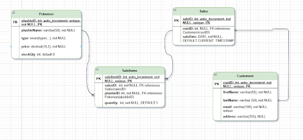
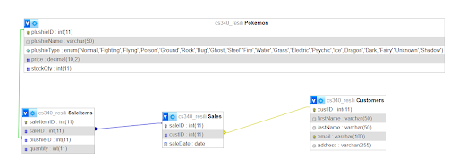

# PokePlushDatabase

## Citation

This project used walkthrough establised in based on the Flask Starter App - README and example code.

- **Source URL:** [https://github.com/osu-cs340-ecampus/flask-starter-app/tree/master](https://github.com/osu-cs340-ecampus/flask-starter-app/tree/master)  
- **Date Retrieved:** February 20th, 2025  
- **Type:** Source Code  
- **Notes:** We used this guide to Flask as a reference for providing structure but wrote our own code. Any modifications, additional features, and functionality are original contributions.

# PokéPlush Paradise Sales Management System

## Executive Summary
### Database & SQL Updates
- Standardized column names:
  - `customerID` → `custID`
  - `salesID` → `saleID`
  - `pokeID` → `plushieID`
  - `title` → `plushieName`
- Clarified that `saleID` is unique in the database outline.
- Expanded business overview to emphasize the need for a database-backed website.
- Defined the M:N relationship between Pokémon and Sales.
- Updated `SaleItems` to use `plushieID` instead of `pokeID`.
- Made `custID` nullable in `Sales`, allowing for anonymous purchases.
- Removed `totalAmount` from `Sales` (redundant with `SaleItems`).
- Changed `saleDate` type from `DATETIME` to `DATE` for accuracy.
- Defaulted `quantity` to 1 in `SaleItems` to prevent null values.
- Expanded `dml.sql` to include correct foreign key inserts and missing attributes.

### Website Features & Fixes
- Implemented full CRUD for `Sales` and `SaleItems`, making all pages fully functional.
- Added dropdowns for all foreign key fields:
  - `Sales` now has a `Customer ID` dropdown.
  - `SaleItems` now has `Sale ID` & `Plushie ID` dropdowns linked to real data.
- Updated Pokémon page to prevent adding without a name, aligning it with `Customers`.
- Added validation to prevent negative prices & quantities for Pokémon and `SaleItems`.
  - `SaleItems` quantity must be at least 1, preventing invalid entries.
- Improved UI by adding space between form elements in modals for better readability.
- Sorted Pokémon types alphabetically in the Pokémon Add Modal.
- Enhanced error handling with alerts for invalid data entries (negative values, empty fields).

### Final Fixes & Optimizations
- Linked `Customer Name` to `saleID` in `SaleItems` dropdowns for clarity.
- Refactored SQL queries in `app.py` to correctly fetch `plushieID` and relationships between `Sales`, `Customers`, and `Pokemon`.
- Added comment headers to all HTML files and `app.py` for better documentation.
- Updated ER Diagram to reflect the 1:M relationships:
  - `Sales` → `SaleItems`
  - `Pokemon` → `SaleItems`
- Finalized `index.html` with a site description and entity table explaining the database structure.
- Added a favicon and ensured it loads correctly across all pages.

---

## Overview
**PokéPlush Paradise** sells high-quality Pokémon plushies for fans and collectors alike. Our extensive collection includes Pokémon from all generations, totaling over **1,000 plushies**. With each new generation introducing more than **100 new Pokémon**, our product lineup continues to expand.

As our business grows, managing inventory, sales, customer information, and order processing has become increasingly difficult due to outdated, manual record-keeping methods. These inefficiencies result in:
- **Time loss** in tracking inventory.
- **Errors** in sales and order processing.
- **Delays** in fulfilling customer orders.
- **Difficulties** in analyzing sales trends.

With estimated **annual sales of 20,000 plushies** and a growing revenue of **$500,000 to $1,000,000**, a modern database-backed website is essential for streamlining operations and improving efficiency.

---

## Database Outline
### Pokémon (Plushies)
Stores information about Pokémon plushies.
- `plushieID`: `int`, `auto_increment`, `unique`, `not NULL`, `PK`
- `plushieName`: `varchar(50)`, `not NULL`
- `type`: `enum(types...)`, `not NULL`
- `price`: `decimal(10,2)`, `not NULL`
- `stockQty`: `int`, `DEFAULT 0`
- **Relationship**: M:N with `Sales` through `SaleItems`

### Customers
Stores customer information.
- `custID`: `int`, `auto_increment`, `unique`, `not NULL`, `PK`
- `firstName`: `varchar(50)`, `not NULL`
- `lastName`: `varchar(50)`, `not NULL`
- `email`: `varchar(100)`, `not NULL`, `unique`
- `address`: `varchar(255)`, `NULL`
- **Relationship**: 1:M with `Sales` (via `custID` as FK)

### Sales
Represents a transaction where a customer purchases plushies.
- `saleID`: `int`, `auto_increment`, `unique`, `not NULL`, `PK`
- `custID`: `int`, `NULL`, `FK` references `Customers(custID)`
- `saleDate`: `DATE`, `not NULL`, `DEFAULT CURRENT_DATE`
- **Relationship**: M:N with `Pokemon` through `SaleItems`

### SaleItems
Handles the many-to-many relationship between `Sales` and `Pokemon`.
- `saleItemID`: `int`, `auto_increment`, `unique`, `not NULL`, `PK`
- `saleID`: `int`, `not NULL`, `FK` references `Sales(saleID)`
- `plushieID`: `int`, `not NULL`, `FK` references `Pokemon(plushieID)`
- `quantity`: `int`, `not NULL`, `DEFAULT 1`
- **Relationship**: M:N between `Sales` and `Pokemon`
---

## ER Diagram

---

## Schema

---

## Project URL
[PokéPlush Paradise Sales Management System](http://classwork.engr.oregonstate.edu:56545/)

---
### Authors
- **Archie McQuown**
- **Isabelle Resil**

